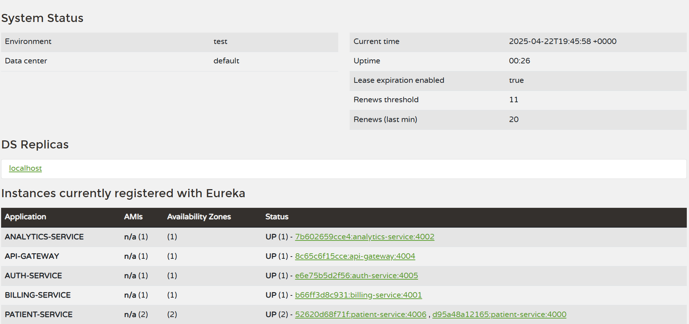

# Service Discovery and API Gateway Interaction

## Eureka Dashboard Overview

The following image is a **screenshot of the Eureka Dashboard** running on `localhost:5761`.  
It demonstrates the **service discovery mechanism** within the system.

- Multiple services have been successfully **registered** with the Eureka Server.
- The **`patient-service`** has **two instances** registered.
- The **API Gateway** (`api-gateway` service) is itself registered as a Eureka client.
    - Upon registration, the gateway **retrieves the registry information** (i.e., a copy of available service instances) from Eureka.
    - It uses this **dynamic service registry** to **resolve service names** and **route incoming client requests** (not implemented yet) to the appropriate service instance **without hardcoding any service addresses**.
    - The gateway supports **load balancing** across multiple instances of a service automatically.

This architecture enables **dynamic scaling** and **resilient communication** between microservices without manual endpoint management.
